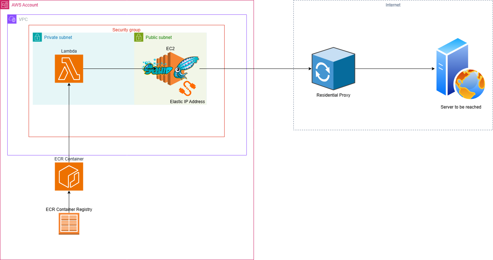

To setup the proxy sever:

ssh -i "my_key_location.pem" my-ec2-user@ec2_ip

sudo yum install squid -y
sudo vi /etc/squid/squid.conf

#copy and paste squid.conf

sudo systemctl restart squid
sudo systemctl enable squid